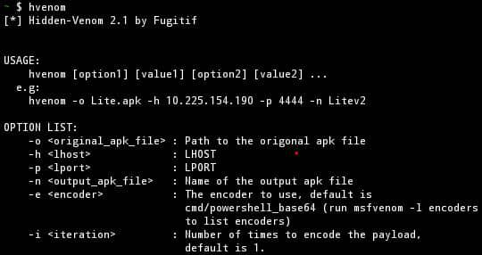

<h2 align="center"><u>Hidden-Venom</u></h2>

<h4 align="center"> •••ʌ!ʌɐ⊥•εℓ•Cʁ!ɯℨи••• </h4>

 

### [+] Disclaimer
It is prohibited to rig an application of which one is not the author, just as it is prohibited to hack the telephone of a third party without his approval. The author of this tool is in no way responsible for the misuse you make of it.

### [+] Prerequisites
<li><a href="https://f-droid.org/en/packages/com.termux/">Termux</a></li>
<li><a href="https://apk-editor.fr.uptodown.com/android/telecharger"> Apkeditor</a></li>
<li><a href="https://github.com/h4ck3r0/apktool-termux">Apktool</a></li>
<li>Apksigner (pkg i apksigner)</li>
<li>Metasploit</li>

### [+] Installation
To use Hidden-Venom on ur terminal, install it with the following commands:
<li><code> apt update </code></li> 
<li><code> apt upgrade </code></li>
<li><code> pkg install python -y </code></li>
<li><code> pkg install git -y</code></li>
<li><code> git clone https://github.com/Fugitif-vector/Hidden-Venom</code></li>
<li><code> cd Hidden-Venom</li></code>
<li><code> chmod +x *</li></code>
<li><code> bash setup.sh</li></code>
<i> Or use the simple command</i>
<li><code> apt update; apt upgrade; pkg install python -y; pkg install git -y; git clone https://github.com/Fugitif-vector/Hidden-Venom; cd Hidden-Venom; chmod +x *; bash setup.sh</code></li>

### [+] Usage
Once installed, u can run Hidden-Venom from any repository with the single command <code>hvenom</code>. 

### [+] Screenshots

 
 
 

### What is new in 2.1
   •Encoders:

You can now use encoders for your payload in order to escape antiviruses

   •Check Update:

The program checks at each start whether there are new updates.

### Note
I'm working on a project with <a href="https://github.com/spurpositivity">Positive Vibes</a> and <a href="https://github.com/Anon7711">Anon771</a>. Please take a minute and star <a href="https://github.com/spurpositivity/UXV-INC-">our repository</a>.
